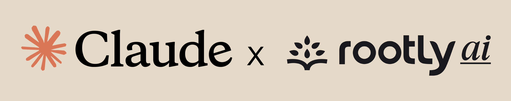

<p align="center">
  
</p>

<h1 align="center">Rootly for Claude Code</h1>

<p align="center">
  <strong>Incident management meets AI-powered development.</strong><br />
  Prevent, respond, and learn from incidents -- without leaving your terminal.
</p>

<p align="center">
  <a href="https://rootly.com/integrations/claude"></a>
  <a href="https://github.com/Rootly-AI-Labs/rootly-claude-plugin/blob/main/LICENSE"></a>
  <a href="#installation"></a>
</p>

<br />

---

## Why

You're in the zone writing code. Then:

- You `git push` and realize there's a SEV-1 in progress
- You get paged and scramble between Slack, Datadog, and your incident tool
- The retro after an incident takes hours to compile

**This plugin brings Rootly's incident lifecycle into Claude Code** -- so you can assess deployment risk, investigate incidents, check on-call, and generate retrospectives from the same terminal where you write code.

---

## What You Get

<table>
<tr>
<td width="50%">

### Before You Deploy
```
> /rootly:deploy-check
```
Analyzes your git diff against past incidents. Warns you if similar changes caused outages before. Checks if on-call coverage exists.

</td>
<td width="50%">

### When You Get Paged
```
> /rootly:respond INC-4521
```
Pulls full incident context, finds similar past incidents, suggests proven solutions, and shows who's on-call -- all in one brief.

</td>
</tr>
<tr>
<td width="50%">

### During Your Shift
```
> /rootly:oncall
```
See who's on-call across all schedules, shift metrics, upcoming handoffs, and health risk indicators.

</td>
<td width="50%">

### Service Health Check
```
> /rootly:status
```
Quick overview of all services with active incidents grouped by severity and age.

</td>
</tr>
<tr>
<td width="50%">

### Stakeholder Communication
```
> /rootly:brief INC-4521
```
Generate executive-friendly incident summaries with impact, timeline, and current status for stakeholder updates.

</td>
<td width="50%">

### Shift Handoffs
```
> /rootly:handoff
```
Create structured handoff documents for incident commanders or on-call transitions with context and next steps.

</td>
</tr>
<tr>
<td width="50%">

### Ask Questions
```
> /rootly:ask "incidents this week"
```
Natural language queries about your incident data, on-call schedules, and service reliability patterns.

</td>
<td width="50%">

### After the Dust Settles
```
> /rootly:retro INC-4521
```
Generates structured retrospectives from incident data: timeline, contributing factors, action items, and systemic patterns.

</td>
</tr>
</table>

### Setup & Configuration
```
> /rootly:setup
```
First-time plugin setup with API token validation, service mapping, and quick-start guide.

---

## Installation

You can use this plugin in two ways:

- **Marketplace install** for a persistent Claude Code installation
- **Local `--plugin-dir` loading** for development and evaluation from source

### Marketplace Install

This repository includes `.claude-plugin/marketplace.json`, so Claude Code can use the repo itself as a marketplace source.

1. Add the marketplace:

```text
/plugin marketplace add Rootly-AI-Labs/rootly-claude-plugin
```

2. Open the plugin manager:

```text
/plugin
```

3. In the **Discover** tab, select `rootly` and install it to your preferred scope:

- **User**: available across all your projects
- **Project**: shared through this repository's `.claude/settings.json`
- **Local**: only for you in this repository

4. Reload plugins so the install takes effect immediately:

```text
/reload-plugins
```

5. When Claude Code prompts for the plugin's configuration, paste your Rootly API token, then run:

```text
/rootly:setup
```

### Local Source Loading

#### Step 1: Clone the Plugin

```bash
git clone https://github.com/Rootly-AI-Labs/rootly-claude-plugin.git
cd rootly-claude-plugin
```

#### Step 2: Load It in Claude Code

```bash
claude --plugin-dir .
```

Claude Code loads the plugin directly from this directory for the current session. This is the recommended flow for local development and evaluation. For a persistent install, use the marketplace flow above.

#### Step 3: Provide a Rootly API Token

Get a token from your Rootly dashboard under **Settings > API Keys**.

The plugin manifest now declares a prompted plugin option for `ROOTLY_API_TOKEN`, and the bundled `.mcp.json` uses it automatically for the hosted Rootly MCP server.

If Claude Code does not prompt for plugin options in your environment yet, you can still use the development fallback:

```bash
export ROOTLY_API_TOKEN="your-token-here"
```

#### Step 4: Verify

```
/rootly:setup
```

### Direct MCP Access

This repository is a Claude Code plugin. If you only want direct Rootly MCP access in Claude Desktop / Cowork, configure the MCP server separately:

```json
{
  "mcpServers": {
    "rootly": {
      "command": "npx",
      "args": [
        "-y", "mcp-remote",
        "https://mcp.rootly.com/mcp",
        "--header", "Authorization:Bearer YOUR_TOKEN_HERE"
      ]
    }
  }
}
```

Replace `YOUR_TOKEN_HERE` with your Rootly API token, then restart the app.

---

## Commands

| Command | What It Does |
|---------|-------------|
| `/rootly:setup` | First-run configuration and connection check |
| `/rootly:deploy-check` | Pre-deploy risk analysis against incident history |
| `/rootly:respond [id]` | Investigate and respond to a live incident |
| `/rootly:oncall [team]` | On-call dashboard with shift metrics |
| `/rootly:retro [id]` | Generate a post-incident retrospective |
| `/rootly:status [service]` | Service health overview -- active incidents at a glance |
| `/rootly:ask [question]` | Ask anything about your incident data in plain English |

### Natural Language Queries

```
/rootly:ask how many SEV-1 incidents did we have last month?
/rootly:ask which service has the most incidents this quarter?
/rootly:ask who's been on-call the most in the last 30 days?
```

---

## Deep Investigation Agents

When a slash command isn't enough, Claude automatically invokes specialized agents for deeper analysis:

| Agent | Triggered When | What It Does |
|-------|---------------|--------------|
| **Incident Investigator** | You need root cause analysis beyond initial triage | Builds hypothesis trees, correlates alerts with code changes, traces causation chains |
| **Deploy Guardian** | Multi-service deployments with cross-team impact | Maps blast radius across dependent services, evaluates downstream risk, builds coordination checklists |
| **Retro Analyst** | You want to understand patterns across incidents | Clusters incidents by failure mode, calculates frequency trends, identifies systemic reliability issues |

---

## Automatic Hooks

Two lightweight hooks run in the background -- they **never block** your workflow:

| Hook | When | What It Does |
|------|------|--------------|
| **Token check** | Session start | Validates your API token and nudges you to configure one if missing |
| **Incident warning** | Before `git commit` / `git push` | Warns if there's an active critical incident -- so you don't deploy into a fire |

---

## Service Mapping

Map your repository to Rootly services by creating `.claude/rootly-config.json`:

```json
{
  "services": ["auth-service", "auth-worker"],
  "team": "platform-team"
}
```

`/rootly:setup` walks you through creating this. Without it, the plugin falls back to matching your git repo name against Rootly service names.

---

## Advanced

<details>
<summary><strong>Self-hosted Rootly</strong></summary>

```bash
export ROOTLY_API_URL="https://rootly.internal.example.com"
```

This overrides the REST API base URL used by hook scripts. Configure the MCP endpoint separately in `.mcp.json`.
</details>

<details>
<summary><strong>Local MCP server</strong></summary>

Replace the HTTP transport in `.mcp.json`:

```json
{
  "mcpServers": {
    "rootly": {
      "command": "uvx",
      "args": ["--from", "rootly-mcp-server", "rootly-mcp-server"],
      "env": {
        "ROOTLY_API_TOKEN": "${user_config.ROOTLY_API_TOKEN}"
      }
    }
  }
}
```
</details>

<details>
<summary><strong>CLI MCP setup</strong></summary>

```bash
claude mcp add rootly --transport http https://mcp.rootly.com/mcp \
  --header "Authorization: Bearer YOUR_TOKEN"
```
</details>

<details>
<summary><strong>Post-push deployment registration</strong></summary>

An optional script (`scripts/register-deploy.sh`) can register deployments with Rootly after `git push`. It is not enabled by default -- see the script header for hook configuration.
</details>

---

## Troubleshooting

| Problem | Fix |
|---------|-----|
| "No API token found" | Re-open the Rootly plugin config and provide a valid token, or set `ROOTLY_API_TOKEN` temporarily when testing with `--plugin-dir`. |
| "API token appears invalid" | Regenerate your key in Rootly: **Settings > API Keys**, then update the plugin config and rerun `/rootly:setup`. |
| MCP tools not responding | Confirm the token works against `https://api.rootly.com/v1/users/me`, then reload the plugin with `/reload-plugins`. |
| Skills not appearing | Run `/reload-plugins`, then check the **Installed** tab in `/plugin`. |
| Hook scripts not running | Run `chmod +x scripts/*.sh` and ensure `jq` or `python3` is available. |

---

## Architecture

See [ARCHITECTURE.md](ARCHITECTURE.md) for the full technical design: MCP integration, hook system, agent orchestration, and data flow.

---

## License

Apache 2.0 -- see [LICENSE](LICENSE).

<p align="center">
  <sub>Built by <a href="https://rootly.com">Rootly AI Labs</a></sub>
</p>
